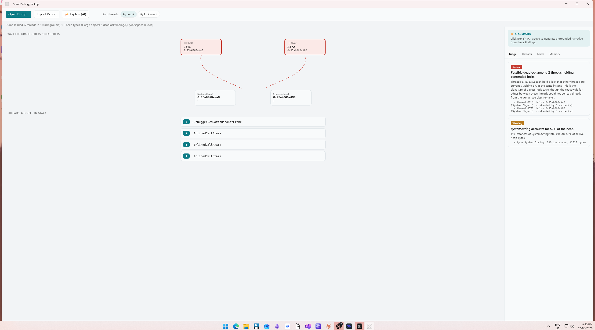
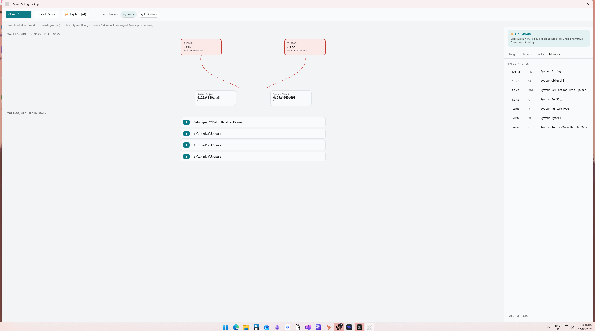

# Dump Debugger

[](https://vibecoded.fyi/)

Dump Debugger is a native Windows application for investigating .NET memory dumps. It turns the manual WinDbg command-grind — `!threads`, `!syncblk`, `!dumpheap -stat`, `!gcroot` held together in your head — into a guided, cross-linked workbench that proposes conclusions instead of just raw data.



## Leads with conclusions, not commands

Deterministic analyzers walk the dump and produce a ranked list of findings — deadlocks, heap composition, thread state — each with the evidence behind it, so you see what's actually wrong before you go digging.

- **Deadlock detection.** Enumerates sync blocks, builds the wait-for relation between threads, and flags contended-lock cycles automatically — the classic two-thread, two-lock deadlock shows up as a critical finding the moment the dump opens.
- **Wait-for graph.** The threads and locks behind a deadlock are drawn as a graph — who holds what, who's waiting on whom — instead of a wall of hex addresses.
- **Stack grouping.** Threads sharing an identical stack collapse into one row with a count, so 200 threads blocked in the same place read as one line, not two hundred.
- **Operation context.** Walks each thread's stack for the unit of work it's doing — an ASP.NET request's method and path when available, otherwise the deepest application frame — so "thread 47 is blocked" becomes "thread 47 is serving `POST /api/orders/checkout` and is blocked."
- **Heap composition and object identification.** Type statistics ranked by total size, plus large-object identification that reads a big object's own fields (strings, anything named `Id`/`Name`/`Key`/`Path`) instead of reporting `byte[] — 84 MB` and leaving you to guess what it is.
- **Dump-to-repo linking.** Every managed stack frame is resolved to its exact source file, commit, and line automatically, via Source Link data embedded in the dump's own PDBs — no repo configuration required, and no matching against a possibly-drifted local checkout, since the commit comes from the build itself. Works whenever the module's PDB is reachable on the analyzing machine (always true for a dump of your own locally-built app).
- **Hot paths.** Ranks application-code frames (framework noise filtered out) by how many distinct threads share them, surfacing genuine choke points — a shared cache getter, a synchronized method — as Triage findings with a source link, not just deadlocked locks.
- **Triage.** All findings from every analyzer, ranked by severity, as the landing view — critical deadlocks first, informational notes last.
- **AI narrative (optional, off by default).** Generates a plain-English summary and next steps from the findings document — never raw memory — via the Claude Code CLI or an `ANTHROPIC_API_KEY`, with the exact payload shown for review before the first send. Associate a local clone of the dump's repo (optional, separate from source-link resolution above) and the narrative is grounded in actual code snippets read at the exact build commit, not just type/method names.
- **Report export.** Writes the current investigation — findings, evidence, narrative — to Markdown for a ticket or a post-mortem.
- **Workspace persistence.** Opening a dump creates a sidecar workspace folder that caches its findings, so reopening the same dump is instant.

## Type statistics and large-object identification



## Runtime coverage

Built on [ClrMD](https://github.com/microsoft/clrmd) (the library SOS itself is built on) rather than shelling out to WinDbg, so field values come back typed instead of parsed from text tables. Supports .NET Framework 4.8, .NET 6, and .NET 8+, across x86 and x64 — ClrMD requires the analyzing process to match the dump's architecture, so Dump Debugger launches an x86 or x64 worker process based on what the dump actually is.

DACs are never bundled — they're resolved at runtime from the dump itself, the local machine, an app-managed cache, or (opt-in) the Microsoft symbol server, in that order.

## Open a dump

- Open a `.dmp` file directly.
- Or generate a test fixture locally with the bundled `DumpDebugger.DumpGen` tool (see below).

## Run locally

Requires the .NET 10 SDK and Windows App SDK on Windows.

```bash
dotnet build src/DumpDebugger.Worker/DumpDebugger.Worker.csproj -r win-x64
dotnet build src/DumpDebugger.Worker/DumpDebugger.Worker.csproj -r win-x86
dotnet build src/DumpDebugger.App/DumpDebugger.App.csproj -p:Platform=x64
```

Then launch it (the `dotnet run` here uses the Windows App SDK's packaged-app launcher, so it needs to run from the App project's directory):

```bash
cd src/DumpDebugger.App
dotnet run -p:Platform=x64 --no-build
```

To generate a test dump for exploring the app:

```bash
dotnet run --project src/DumpDebugger.DumpGen -- ./fixtures/sample.dmp --scenario deadlock
```

`--scenario deadlock` produces a real two-thread, two-lock deadlock; omit it (or pass `simple`) for a plain heap fixture.

## Project layout

| Project | Purpose |
|---|---|
| `DumpDebugger.Core` | Domain model, findings schema, IPC contracts — no ClrMD dependency |
| `DumpDebugger.Analysis` | ClrMD-backed dump loading, DAC resolution, all analyzers |
| `DumpDebugger.Worker` | Thin IPC host around `DumpDebugger.Analysis`, published as x86 and x64 |
| `DumpDebugger.App` | WinUI 3 shell — worker lifecycle, navigation, the workbench UI |
| `DumpDebugger.Llm` | Narrative provider abstraction (Claude Code CLI / Anthropic API / disabled) |
| `DumpDebugger.DumpGen` | Test-fixture generator used above |

See [docs/PLAN.md](docs/PLAN.md) for the full design rationale.
